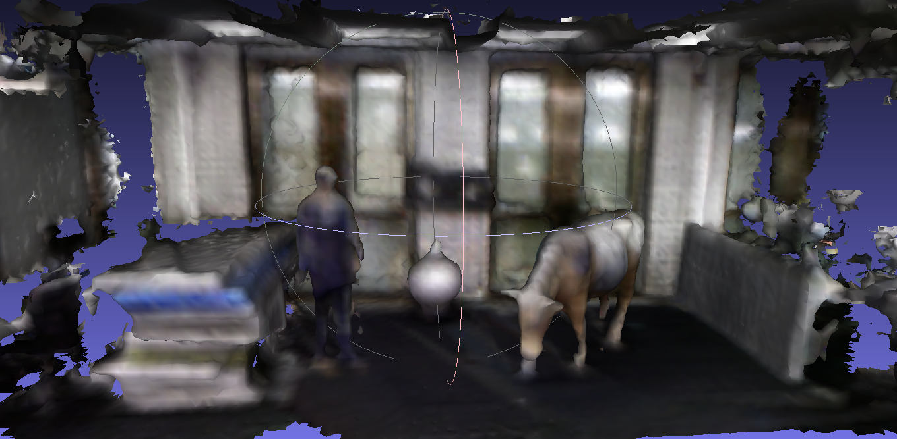
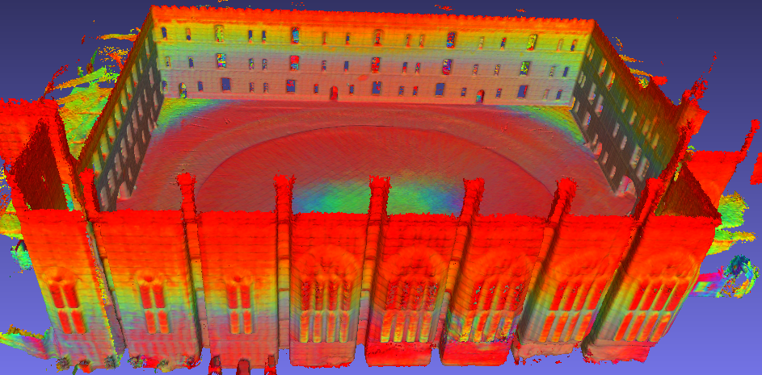

VDB_GPDF for ROS2
---
## 🚀 We now support ROS1, ROS1 Docker and ROS2! 
## 🚀 This branch is the ROS2 version of VDB-GPDF. 
## 🚀 For ROS1 version and ROS1 Docker environment, please go to [the main branch](https://github.com/UTS-RI/VDB_GPDF).
## 🎉 VDB-GPDF is accepted by RA-L 2025.
## 🎉 We will present VDB-GPDF at [IROS 2025, Session Mapping 4](https://ras.papercept.net/conferences/conferences/IROS25/program/IROS25_ContentListWeb_3.html). See you there!

 * [Paper](https://arxiv.org/pdf/2407.09649)
 * [Video](https://youtu.be/xygIuZBvQT8)




# Description
The key aspect is a latent Local GP Signed Distance Field (L-GPDF) contained in a local VDB structure that allows fast queries of the Euclidean distance, surface properties and their uncertainties for points in the field of view. Probabilistic fusion is then performed by merging the inferred values of these points into a global VDB structure that is efficiently maintained over time. After fusion, the surface mesh is recovered, and a global GP Signed Distance Field (G-GPDF) is generated and made available for downstream applications to query accurate distance and gradients. 

# ROS2 Local Install

## Dependencies

To deploy it on your own pc environment. Please install some dependencies. Tested system: Ubuntu 22.04 and ROS2 humble.
- python3 (3.10.12)
- eigen (3.4.0)
- gflag (2.2.2)
- glog (0.5.0)
- openmp (4.5)
- boost (1.80)
- [OpenVDB](https://github.com/nachovizzo/openvdb.git): (9.1.1)

If you have ROS2 already, then hopefully installing the OpenVDB will be enough.

## Dependencies of OpenVDB

system
```bash
sudo apt-get update && sudo apt-get install -y libblosc-dev \
    libboost-iostreams-dev \
    libboost-system-dev \
    libboost-system-dev \
    libeigen3-dev \
    && rm -rf /var/lib/apt/lists/*
```

## Source Code of OpenVDB

Install openvdb from source
```bash
git clone --depth 1 https://github.com/nachovizzo/openvdb.git -b nacho/vdbfusion \
    && cd openvdb \
    && mkdir build && cd build \
    && cmake  -DCMAKE_POSITION_INDEPENDENT_CODE=ON -DUSE_ZLIB=OFF .. \
    && make -j$(nproc) all install # we can use -j4 to save ram
```

reference from: [http://gitlab.ram-lab.com/ramlab_dataset_sensor/mapping_codebase/vdbmapping](http://gitlab.ram-lab.com/ramlab_dataset_sensor/mapping_codebase/vdbmapping)

more official install and problems, please click [here: https://www.openvdb.org/documentation/doxygen/build.html](https://www.openvdb.org/documentation/doxygen/build.html)


## Clone the VDB_GPDF

```bash
git clone --recurse-submodules git@github.com:UTS-RI/VDB_GPDF.git
```
Please remove the catkin_simple package and minkindr package in 3dparty folder if you have them already.

# Dataset

VDB_GPDF can work with depth cameras and LiDAR datasets. It is tested using the [Cow and Lady](https://projects.asl.ethz.ch/datasets/doku.php?id=iros2017/), [Kitti](https://www.cvlibs.net/datasets/kitti/eval_odometry.php), [Newer College](https://ori-drs.github.io/newer-college-dataset/), [Mai City](https://www.ipb.uni-bonn.de/data/mai-city-dataset/index.html) datasets. You can modify the parameters in roslaunch, and config yamls to work with your own dataset. To run it with a live sensor, please disable the data_buf in yaml.

Temporary [link](https://studentutsedu-my.sharepoint.com/:f:/g/personal/lan_wu-2_uts_edu_au/ErIMhH3OdDFDqeBdsA85S30Bf9tlajX_SXdK44P8t3i4jw?e=pvPzP6) for a section of the Cow and Lady dataset (converted_ros2_bag.zip) for you to try quickly with ros2.

# Run

After sourcing your bash, run the roslaunch for the cow and lady dataset directly. 
```bash
ros2 launch vdb_gpdf_mapping vdb_gpdf_mapping_cow.py
```

# Services

During or after the running, we can call the services. The save_map service is to save the map as .pcd and .ply under your path. After calling, it will also publish the vertices (as a point cloud) of the reconstructed mesh too. You can visualise in rviz (topic name: /vdbmap). 

```bash
string path
float64 filter_res
---
bool success
```

To call the above service for saving the map, please use this example:

```bash
ros2 service call /save_map vdb_gpdf_mapping_msgs/srv/SaveMap "{filter_res: 0.005, path: '/home/lan/Downloads/'}"
```

We have two query_map services to query the representation for distance and gradients. 
The input is a set of points or a slice, and the output contains time stamps, gradients, distances, and if observed.

Points query service: /points_query_map

```bash
float64[] points
---
builtin_interfaces/Time stamp
float64[] gradients
float64[] distances
bool[] if_observed
```

Slice query service: /slice_query_map

```bash
float64[] slice_ranges
---
builtin_interfaces/Time stamp
float64[] points
float64[] gradients
float64[] distances
bool[] if_observed
```

The boundary of the main area of the cow and lady dataset is:

```bash
x: -3, 0.5
y: -3, 3
z: 0, 2.8
```

Example: To query 4 points of the cow and lady dataset:

```bash
ros2 service call /points_query_map vdb_gpdf_mapping_msgs/srv/PointsQueryMap "{points: [-1.5,0,0.9,-1.5,0,1.0,-1.5,0,0.95,-1.5,0,0.96]}"
```

Example: To query a slice of the cow and lady dataset:

```bash
ros2 service call /slice_query_map vdb_gpdf_mapping_msgs/srv/SliceQueryMap "{slice_ranges: [-3.0,3.0,-3.0,0.3,0.9,0.05]}"
```

# Citation

```
@article{wu2025vdb,
  author={Wu, Lan and Le Gentil, Cedric and Vidal-Calleja, Teresa},
  journal={IEEE Robotics and Automation Letters}, 
  title={VDB-GPDF: Online Gaussian Process Distance Field With VDB Structure}, 
  year={2025},
  volume={10},
  number={1},
  pages={374-381},
  doi={10.1109/LRA.2024.3505814}
}
```


# Acknowledgement

We sincerely thank the authors of the repositories listed below for making their code available.

- [Kin-Zhang/vdbfusion_mapping](https://github.com/Kin-Zhang/vdbfusion_mapping): for providing the code structure and fixing the pose issue

- [PRBonn/vdbfusion_ros](https://github.com/PRBonn/vdbfusion_ros) the vdbfusion framework

- [jianhao jiao](https://github.com/gogojjh): the first version on vdbfusion mapping ros

- [paucarre](https://github.com/paucarre): the rgb version on vdbfusion

- [ethz-asl/voxblox](https://github.com/ethz-asl/voxblox): the voxblox framework with mesh and distance field

# Parameters

All parameters and dafault values can be found as yaml files in the config folder.

|Parameter|Description|Type|Recommended Value|
|---|---|---|---|
|lider_topic|input point cloud topic|std::string|depend on dataset|
|pose_source|we have three options for the input pose|int|0: tf_tree option, need to provide child_frame and world_frame;<br>1: tf_topic option, need to provide tf_topic;<br>2: odom_topic option, need to provide odom_topic|
|world_frame|world frame for the map|std::string|"world"|
|timestamp_tolerance_ms|time tolerance between the pose and the raw point cloud in ms|double|2|
|debug_print|if to print some debugging information|bool|false|
|enable_databuf|to enable a databuf for the incoming point clouds|bool|false: live camera;<br>true: pre-recorded dataset|
|min_scan_range|min scan range respect to the sensor position|double|depend on dataset|
|max_scan_range|max scan range respect to the sensor position|double|depend on dataset|
|max_height|max height respect to the sensor position|double|depend on dataset|
|fill_holes|to fill holes for the mesh reconstruction|bool|true|
|use_color|to use color as surface property for fusion and gp inference|bool|true|
|sdf_trunc|this param is for vdbfusion comparison|float|depend on dataset and voxel resolution|
|space_carving|this param is for vdbfusion comparison|bool|true|
|distance_method|method to compute the distance|int|0: RevertingGPDF, refer the paper "Accurate Gaussian-Process-based Distance Fields with applications to Echolocation and Mapping";<br>1: LogGPDF, refer the paper "Faithful Euclidean Distance Field from Log-Gaussian Process Implicit Surfaces"|
|sensor_type|to choose depth camera or lidar|int|0: depth camera;<br>1: lidar|
|voxel_size_local|voxel size for local gp model|float|depend on dataset|
|voxel_overlapping|if to have overlapping area between local gps|int|positive: enable with value to control overlapping area;<br>negative: disable|
|voxel_downsample|further downsample even after the voxelisation|int|positive: enable with an int value to control the further downsampling;<br>1: disable|
|voxel_size_global|voxel size for global gp model. this is the map resolution|float|depend on dataset. this is the map resolution|
|variance_method|fusion method|int|0: not use variance, constant weight;<br>1: use variance, weight = 1-variance;<br>2: use occupancy u(x) variance, probabilistic fusion, 1/variance;<br>3: use distance v(x) variance, probabilistic fusion, 1/variance|
|variance_cap|cap the variance|float|0.5|
|variance_on_surface|to setup a variance on the surface|float|0.001|
|recon_min_weight|min weight for the mesh|double|0.5|
|surface_normal_method|we have two options to compute surface normals|int|0: pcl library;<br>1: raycasting|
|surface_normal_num|number of points to contribute the normal|int|10|
|surface_value|setup the surface points value|float|-1: set up the surface value as inside;<br>1: set up the surface value as outside|
|query_iterval|query voxels for local gp: voxel interval|float|same as map resolution|
|query_trunc_in|query voxels for local gp: trunc inside of the surface|int|depend on dataset|
|query_trunc_out|query voxels for local gp: trunc outside of the surface|int|depend on dataset|
|freespace_iterval|query voxels for local gp: voxel interval in freespace, important for dynamic performance|float|same as map resolution|
|freespace_trunc_out|query voxels for local gp: trunc outside of the surface|int|depend on dataset|
|query_downsample|after we have all query voxels for local gp, if we downsample it|float|positive: enable with a value for the downsampling voxel resolution;<br>negative: disable|
|map_lambda_scale|RevertingGPDF: map_lambda_scale = 1/(length_scale)^2;<br>LogGPDF: map_lambda_scale = sqrt(3)/length_scale. length_scale is the same definition as in gp kernel|double|depend on dataset|
|map_noise|map noise|double|depend on dataset|
|color_scale|color length scale|double|10|
|smooth_param|smooth param to control the accuracy|double|100|
|tx,ty,tz,x,y,z,w|static tf for pose|double|depend on dataset|
|invert_static_tf|if invert static tf|bool|depend on dataset|